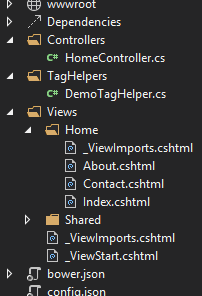

The `@addTagHelper` directive allows you to use Tag Helpers inside of your razor views.

```csharp
@addTagHelper "*, Microsoft.AspNet.Mvc.TagHelpers"
```

Inside the quotes the first part is the type name which in this case uses the wildcard selector `*` to indicate that all Tag Helpers in the assembly namespace should be imported.

The second part, `Microsoft.AspNet.Mvc.TagHelpers`, is the assembly name in which the Tag Helpers live.

To import a single tag helper from a namespace, e.g. the `DemoTagHelper` from the `ImportingTagHelpers` namespace you would specify

```csharp
@addTagHelper "ImportingTagHelpers.DemoTagHelper, ImportingTagHelpers"
```

## Remove Tag Helpers from a view

It is also possible to remove Tag Helpers from a view using the `@removeTagHelper` directive.

```csharp
@removeTagHelper "ImportingTagHelpers.DemoTagHelper, ImportingTagHelpers"
```

This is useful when a Tag Helper has been imported in `_ViewImports` (making it available to all views), and you wish to remove it from a single view, see the following line to the view.

The `@removeTagHelper` directive only applies Tag Helpers which were added prior to it (see the _ViewImports hierarchy section below).

## Add or remove Tag Helpers for all views

With MVC 6 you can import namespaces to use in your views inside the `_ViewImports.cshtml` file which lives in the root of the `Views` directory. In previous versions of MVC this was achieved with the `Web.config` file.

As well as importing namespaces you can also add or remove any Tag Helpers to your views.

## _ViewImports hierarchy

Thanks to the [ASP.NET configuration hierarchy](https://msdn.microsoft.com/en-us/library/ms178685(v=vs.100).aspx), you can add or remove Tag Helpers using `_ViewImports` at different levels.

<aside style="float:right;margin-left:15px;">

</aside>

This gives you the power to remove any Tag Helpers imported at higher directory levels.

For example, say you have `_ViewImports` in your `Views/Home` directory (example on the right), inside this file you could remove any Tag Helpers which were added in the root `_ViewImports` file.

This means that the tag helper is removed from all the Home controller views, but is still present for all other controller views.

## Gotchas

One thing to be aware of is that the directives are case sensitive and require camel casing in order to work correctly.

------

I am currently in the midst of learning as much as possible about Tag Helpers, as I learn more I'll be posting under [the Tag Helpers tag](https://lowflyingowls.co.uk/tag/tag-helpers/).
