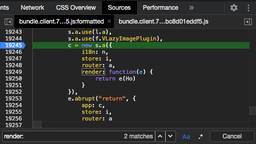
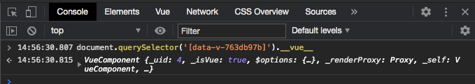

The Vue.js devtools are great to use when in the process of developing a web application. However, once you deploy to production it no longer has access to the code it needs to work. So how can we inspect an application once released to production? In this post, we’ll walk through the options available to you along with some tricks and tips to make the process a little easier.

## Enabling Vue.js devtools

If you do not need to programmatically access part of a component there is a way to enable the Vue.js devtools in the browser.

This is done by first locating the call to `new Vue()` in your compiled code using the sources panel in devtools — this can be quite a pain to track down as the code will likely be minified and obfuscated. One tip which can be useful is to search your JavaScript files for any of the options you might be passing into `new Vue()` e.g. if you are using the render function:

```js
const app = new Vue({
  render: h => h(App)
})
```

Then you can search the minified JavaScript to find a reference to “render: “ and you’ll likely land right at the call to `new Vue()`. In the example below the Vue instance call had been obfuscated to `c = new s.a()`.

Now you need to set a breakpoint where the Vue instance is called. You should press the pretty-print button at the bottom left of the panel at this point otherwise you'll struggle to add the breakpoint in the correct place.



Now refresh the page and once the breakpoint is hit then type `Vue.config.devtools = true` in the devtools console.

> In Vue.js, by default, [the devtools config setting is determined by the value of `process.env.NODE_ENV`](https://github.com/vuejs/vue/blob/0948d999f2fddf9f90991956493f976273c5da1f/src/core/config.js#L54), what we’re doing here is manually setting that value to `true` in order to [force Vue.js to initiate the Vue.js devtools](https://github.com/vuejs/vue/blob/0948d999f2fddf9f90991956493f976273c5da1f/src/platforms/web/runtime/index.js#L50).

Finally, close devtools and re-open. You should now see the Vue panel and can use most of the features. I say most of the features as I couldn’t get the Vuex panel to work whilst testing this technique.

## Programmatically inspecting a Vue component instance

As mentioned in the last section, you may need to access Vue component instances to read values out e.g. when writing a browser plugin where you might need to read values out or hook onto them in some way.

### Triggering a prop value update

As well as figuring out how to inspect the Vue internal variables let’s also attempt to update a component prop value.

Say we have a component which has a prop controlling the text of an element, how can we force the value to change in order to trigger a UI update?

```js
<template>
  <h1>{{ msg }}</h1>
</template>

<script>
export default {
  props: {
    msg: {
      type: String,
      default: ''
    }
  }
};
</script>
```

### Finding the Vue component instance

To start we need to locate the top-level element of the component using the Chrome devtools elements panel. In this case, the element is the `h1`.


#### Using the `$0` command

Once you have the element selected you can then move to the console panel in devtools and type `$0`.

`$0` will be a reference to the most recently selected element in the element panel.

> If you highlight another element you can still reference the last one by typing $1, this will work for the last 5 elements highlighted.

To see the Vue instance details you can type `$0.__vue__`.


#### Using the `document.querySelector` method

You can also select the element using any of the DOM lookup methods such as `querySelector` or `getElementById` etc. In this case, we’ll use `document.querySelector` to see the Vue instance:

```js
document.querySelector('[data-v-763db97b]').__vue__
```

Here we’re using looking up the element via its data attribute, but you can use any valid CSS selector within `querySelector`.



### Locating the prop value

Now that we have a reference to the Vue component instance we can expand it in the console to see what’s inside:


Welcome to the guts of Vue.js! Here you can see all of the object properties Vue has attached to the component. If you're using any plugins such as Vuex or vue-i18n you’ll see a reference to them here as well.

Let’s continue with our task of updating the prop value. Look carefully and you’ll see our `msg` prop right in the middle, click on the three dots and you’ll see the current value of the prop.

You can view the prop value on its own using your preferred command in the console:

```js
// Using $0
$0.__vue__.msg

// Using querySelector
document.querySelector('[data-v-763db97b]').__vue__.msg
```

### Updating the prop value

Updating the prop value is now a case of updating the variable assignment to your desired value. So, for example, using the `$0` technique above you’d type this into the console:

```js
$0.__vue__.msg = 'Hello from the updated value!'
```

Lo and behold you’ll see the UI update before your very eyes!

## Conclusion

In this post, we’ve used the Chrome devtools console to locate elements and inspect the related Vue component instance details, as well as manipulating the Vue instance object to update a prop value.

One thing to note is that you aren’t limited to just string values, you can update any other type of prop such as booleans and numbers.

There are limitations with the types of things you can update using this technique such as not being able to update computed properties as they have no setter. Still, being able to inspect the values assigned to components in production can be extremely useful.

Finally, if you ever need to inspect a Vuex store in production, check out this post which walks you through how to set up [logging of Vuex actions and mutation information to the devtools console](/logging-vuex-actions-and-mutations-in-the-wild/).
