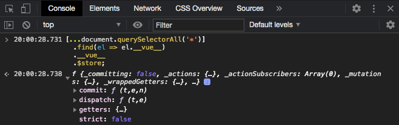
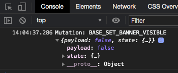
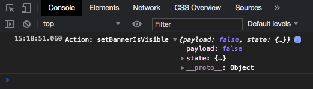
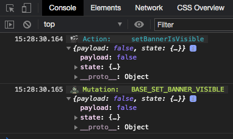

So you've built a Vue application which uses Vuex to manage state and have deployed it to production. You fire it up to check that all is working but notice some broken functionality which is handled by Vuex.

There are [ways to inspect a Vue application in production](/inspecting-a-vue-application-in-production/) but it's not always easy to locate the Vue instance, and even if you do it isn't guaranteed that the Vuex panel of the Vue devtools will be able to function correctly.

Is there a way to inspect the Vuex store? If so, is there also a way to automatically log out details of any actions or mutations as they occur?

The answer is yes! Read on to find out more.

## Locating the store instance

The first step is to locate the Vuex store instance, this will be a property on the Vue instance object.

A quick way to find the store instance is to use the code below which loops through each element on the page, starting at the top, checking for an object called `__vue__`. Once this is found it will return the `$store` instance which is attached to the  `__vue__` object.

```js
const store = [...document.querySelectorAll('*')]
  .find(el => el.__vue__)
  .__vue__
  .$store;
```

> Note that the result of `querySelectorAll` is spread into [an array using the spread operator](https://developer.mozilla.org/en-US/docs/Web/JavaScript/Reference/Operators/Spread_syntax), this is because it returns a `NodeList` rather than an array and doesn't have the array prototype functions such as `find` available.

### Manually locating the store instance

If you are not able to use the technique above, maybe you have multiple instances of Vue on your page and you need to target one specifically, then you'll need to take another approach.

You'll need to find the Vue instance by locating the root element of your application — this is the element you target when mounting the application.

[](devtools-root-element.png)

In this application, the root element has a data attribute of `data-app`. We can use `querySelector` to target the element using the data attribute and then return the `$store` instance which is attached to the  `__vue__` object:

```js
const store = document.querySelector('[data-app]')
	.__vue__
	.$store;
```

> You can specify any valid CSS selector when using `querySelector`.

## The Vuex instance

After following the steps above you should see something similar to this

[](devtools-vuex-instance-expanded.png)

Pay dirt! We've located the Vuex instance. At this point, you can inspect the properties available to you such as `state` to see the current state of the application. But what if you want to check the state at each point after a series of actions or mutations happen?

## Subscribing to actions and mutations

Luckily, Vuex offers a way to subscribe to action and mutation calls using the `subscribe` & `subscribeAction` functions.

### Subscribe to mutations

First up we'll look at subscribing to mutations using `subscribe`. This function accepts a callback handler function with two parameters; a mutation object containing the `type` & `payload`, and the post-mutation state.

We can use these properties to log out the information as mutations occur:

```js
store.subscribe((mutation, state) => {
	console.log(`Mutation: ${mutation.type}`, {
    payload: mutation.payload,
    state
  });
});
```

> If you are only interested in a single state property you can log that out instead of the entire `state` object.

After running this code in the browser devtools console, whenever you trigger a mutation in your application you should see something similar to this:

[](devtools-log-mutation.png)

### Subscribe to actions

You can subscribe to actions by using `subscribeAction`. Similar to the last section, this function accepts a callback handler function with two parameters; an action object containing the `type` & `payload`, and the current state.

We can log these out like so

```bash
store.subscribeAction((action, state) => {
	console.log(`Action: ${action.type}`, {
    payload: action.payload,
    state
  });
});
```

Running this code and triggering an action will output something similar to this:

[](devtools-log-action.png)

## Adding some flair

Let's take those dull `console.log` statements and make them a little more exciting by adding some emoji and colour. We can also do a little refactoring along the way.

```js
const store = [...document.querySelectorAll('*')]
  .find(el => el.__vue__)
  .__vue__
  .$store;

store
  .subscribe(({ type, payload }, state) => {
    console.log(
      `%c 🧟‍♀️ Mutation:   ${type} `,
      'background: #333; color: #bada55',
      {
        payload,
        state
      }
    );
  });

store
  .subscribeAction(({ type, payload }, state) => {
    console.log(
      `%c 🎬 Action:     ${type} `,
      'background: #333; color: #54afbd',
      {
        payload,
        state
      }
    );
  });
```

Here we have

- Subscribed to both mutations and actions
- Destructured the `type` and `payload` properties
- [Applied some colours to the logs](https://developers.google.com/web/tools/chrome-devtools/console/console-write#styling_console_output_with_css)
- Prefixed the logs with an emoji

The result looking like this:

[](devtools-styled-logs.png)

Now it's super clear whether you are looking at an action or a mutation!

## Conclusion

In this post, we walked through how to find and inspect a Vuex store in production, as well as how to log out actions and mutations to the browser devtools console.

It can also be useful if you’re building a browser extension and would like to track changes in the Vuex store.

Next time you hit issues in production and need to quickly be able to see what Vuex is doing behind the scenes, hopefully this technique will come in handy.
